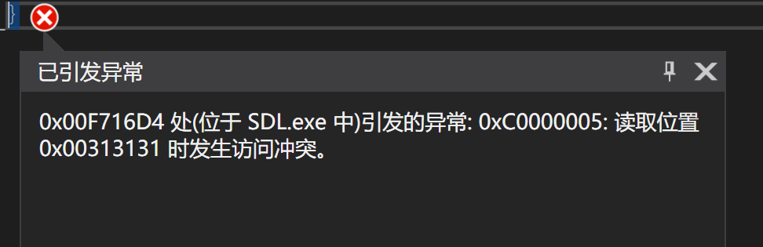
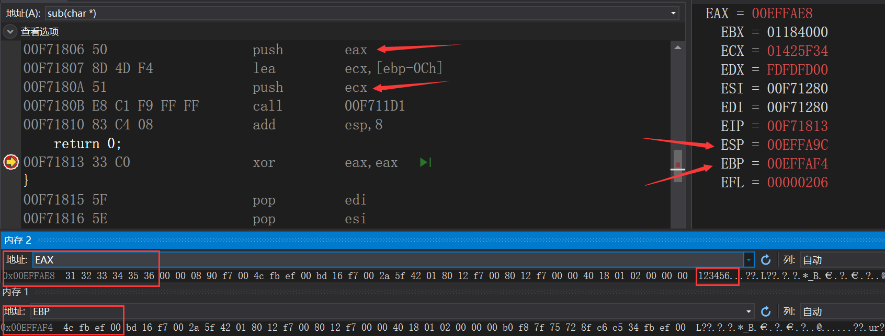
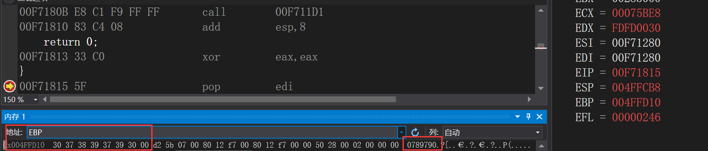

# 缓冲区溢出-原理探究实验

## 实验目的

* 观察、测试和分析一段存在缓冲区溢出漏洞的代码
* 分析缓冲区溢出漏洞出现的原因和效果


## 预备

**关闭IDE的安全检查**

* 关闭**SDL**(Security Development Lifecycle)检查
  * `C/C++`->`SDL检查`->`否`
* 关闭中间代码生成阶段的安全检查
  * `C/C++`->`代码生成`->`启用C++异常`->`否`
  * `C/C++`->`代码生成`->`基本运行时检查`：关闭
  * `C/C++`->`代码生成`->`安全检查`->`禁用安全检查`

## 漏洞代码

```c
#define _CRT_SECURE_NO_WARNINGS

#include <stdlib.h>
#include <stdio.h>
#include <string.h>

int sub(char* x)
{
    char y[10];
    strcpy(y, x);
    return 0;
}

int main(int argc, char** argv)
{
    if (argc > 1)
        sub(argv[1]);
    printf("exit");
}
```


**触发漏洞**

* `调试`->`命令参数`->`设置一段长度尽量大的字串(char y[10])`
* 字串尽量大，保证能覆盖栈帧的`Return Address`


# 实验结果

* 直接调试

  <center></center>

* 加上断点进行调试，证明覆盖了回调地址

  * 测试输入`123456`

    <center></center>
* `EAX`代表输入的的值的地址
    * `ECX`代表分配的`0Ch`空间的地址
    * `call 00F711D1`：strcpy函数
    * 可以看到执行字符串拷贝函数后，`EBP`仍然指向正确的返回地址`00EFFB4C`
    
* 测试输入`1234567891010789790`
  
  <center></center>

  * 可以看到执行字符串拷贝函数后，`EBP`元贝的内容被覆盖了

